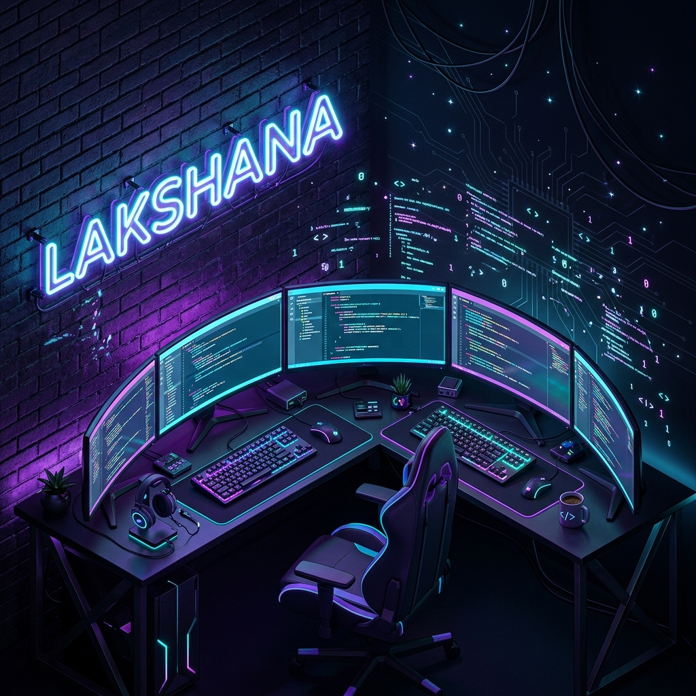
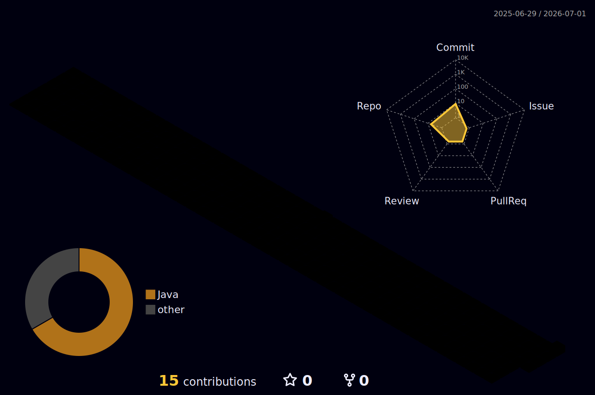

<!-- ██████████████████████████████████████ HEADER BANNER ██████████████████████████████████████ -->
<div align="center">
  
</div>

<!-- ██████████████████████████████████████ ANIMATED TYPING ██████████████████████████████████████ -->
<div align="center">
  <a href="https://git.io/typing-svg">
    
  </a>
</div>

<br/>

<!-- ██████████████████████████████████████ SOCIAL BADGES ██████████████████████████████████████ -->
<div align="center">
  <a href="https://linkedin.com"></a>
  &nbsp;
  <a href="mailto:youremail@gmail.com"></a>
  &nbsp;
  <a href="https://github.com/lakshanalaksh25"></a>
  &nbsp;
  
</div>

<br/>

<!-- ██████████████████████████████████████ DARK DIVIDER ██████████████████████████████████████ -->


<!-- ██████████████████████████████████████ SYSTEM BIO ██████████████████████████████████████ -->
##  &nbsp;System Bio

<table>
<tr>
<td width="55%" valign="top">

```yaml
Name       : LAKSHANA
Username   : lakshanalaksh25
Role       : Software Engineer & Test Automation
Location   : India
Status     : 🟢 ONLINE & BUILDING
Focus      : AI Solutions + Test Automation
```

- 🔭 Currently building **AI-powered document chatbots**
- 🤖 Mastering **Selenium & Test Automation Frameworks**
- 💡 Exploring **GenAI, RAG, and LLM-based solutions**
- ⚡ Fun fact: I turn coffee into code 24/7!

</td>
<td width="45%" valign="top" align="center">


<br/>


</td>
</tr>
</table>


<!-- ██████████████████████████████████████ GITHUB STATS ██████████████████████████████████████ -->
##  &nbsp;GitHub Stats

<div align="center">
  
  &nbsp;
  
</div>

<br/>

<div align="center">
  
</div>


<!-- ██████████████████████████████████████ TECH STACK ██████████████████████████████████████ -->
##  &nbsp;Core Technologies

<div align="center">
  
</div>

<br/>

<div align="center">

| 🌐 Frontend | ⚙️ Backend | 🤖 Automation | 🧠 AI/ML |
|:-----------:|:----------:|:-------------:|:--------:|
| HTML5, CSS3 | Python, Node.js | Selenium WebDriver | LLMs, RAG |
| JavaScript | Java | Postman API | VectorDB |
| React | REST APIs | Test Frameworks | Document AI |

</div>


<!-- ██████████████████████████████████████ PROJECTS ██████████████████████████████████████ -->
## 🚀 &nbsp;Featured Projects

<div align="center">

| Status | Project | Description | Stack | Link |
|:------:|:--------|:-----------|:------|:----:|
| 🟢 | **AI Document Chatbot** | Intelligent chatbot using LLMs & RAG for document Q&A | Python, LLMs, VectorDB | [🔗](https://github.com/lakshanalaksh25/AI-document-based-chatbot) |
| 🟢 | **Woman Safety System** | Safety alert web application | JavaScript, HTML, CSS | [🔗](https://github.com/lakshanalaksh25/Woman-Safety) |
| 🟢 | **Auto Test Framework** | Modular Selenium automation framework | JavaScript, Selenium | [🔗](https://github.com/lakshanalaksh25/AutoTestFramework) |
| 🟣 | **Portfolio Website** | Personal developer portfolio | HTML, CSS, JS | [🔗](https://github.com/lakshanalaksh25/portfolio) |
| 🟣 | **Java Solutions** | Java programming practice & algorithms | Java | [🔗](https://github.com/lakshanalaksh25/java) |

</div>


<!-- ██████████████████████████████████████ 3D CONTRIBUTIONS ██████████████████████████████████████ -->
## 🧱 &nbsp;3D Contribution Architecture

<div align="center">
  
</div>


<!-- ██████████████████████████████████████ ACTIVITY GRAPH ██████████████████████████████████████ -->
## 📈 &nbsp;Contribution Activity

<div align="center">
  
</div>


<!-- ██████████████████████████████████████ FOOTER ██████████████████████████████████████ -->
<div align="center">
  
</div>

<div align="center">
  <sub>© 2026 LAKSHANA &nbsp;|&nbsp; SYSTEM STATUS: OPTIMAL &nbsp;|&nbsp; BUILT WITH ❤️ & CODE</sub>
</div>
